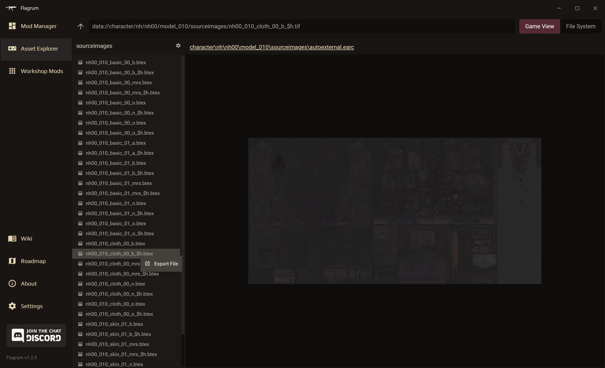
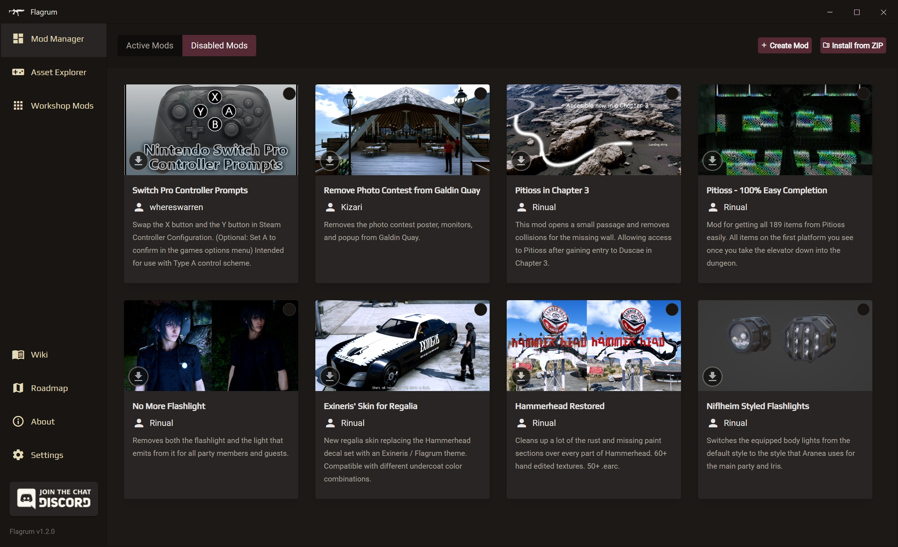
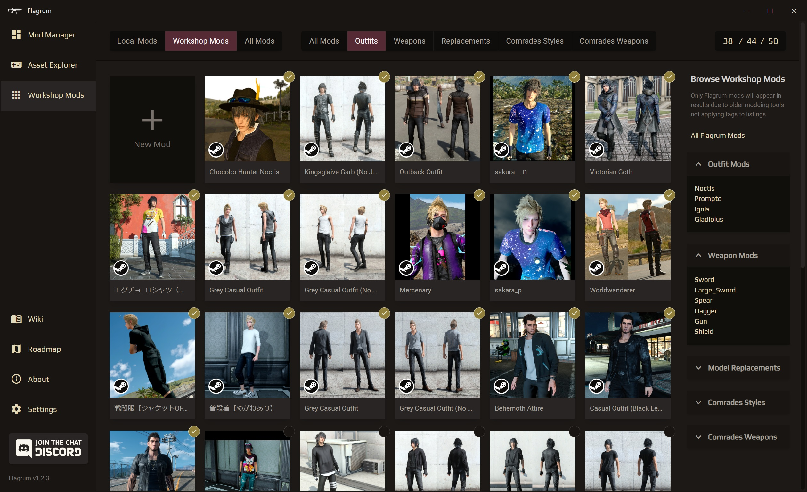

    

<h3 align="center">An all-in-one solution for modders, artists, and players of Final Fantasy XV</h3>

     
<a href="https://github.com/Kizari/Flagrum/releases"></img></a>
<a href="https://www.patreon.com/Kizari"></img></a>
<a href="#support-the-continued-development-of-ffxv-tools"></img></a>

&nbsp;  
&nbsp;

---

<h3 align="center">
Instructions for running <a href="https://github.com/Kizari/Flagrum/wiki/Running-Flagrum-on-Linux">Flagrum on Linux</a> via Proton are now available on the wiki!
</h3>

---
&nbsp;

<h1 align="center">Asset Management</h1>

<pre align="center">
<h3>    ● Browse and preview game files without extracting anything 
    ● The largest range of asset conversions available of any FFXV tools 
    ● Export environments and terrain effortlessly</h3>
</pre>
&nbsp;

 

<h1 align="center">Gameplay Mods</h1>

<pre align="center">
<h3>    ● Install, manage, create, edit, and toggle mods at will 
    ● Built-in tooling to make gameplay modding more manageable 
    ● Easily export your mods for distribution</h3>
</pre>
&nbsp;

 

<h1 align="center">Steam Workshop Mods</h1>

<pre align="center">
<h3>    ● View and manage your Steam Workshop mods and limits 
    ● Alter stats of any outfits you have downloaded from Steam Workshop 
    ● Fast and easy creation of your own Steam Workshop mods</h3>
</pre>
&nbsp;

 

<h1 align="center">Getting Started</h1>
 
<h3 align="center">Installation</h3>

Download the latest version and follow the instructions on the <a href="https://github.com/Kizari/Flagrum/releases/latest">Releases Page</a>.

 
<h3 align="center">Tutorials and Documentation</h3>

All of Flagrum's documentation can be found on the <a href="https://github.com/Kizari/Flagrum/wiki">Wiki</a>.  

 

&nbsp;

 

<h1 align="center">Support the Continued Development of FFXV Tools</h1>
 

These tools take a monumental amount of time and effort to develop. 
If you want to support the ongoing development of Flagrum and my other XV projects, please consider donating.   
&nbsp;&nbsp;
&nbsp;&nbsp;

 

&nbsp;

 

<h1 align="center">Credits</h1>
 
<h3 align="center">Core Development</h3>

<a href="https://github.com/Kizari">Kizari</a>

 
<h3 align="center">Contributors</h3>

<a href="https://github.com/AlexPlaceres">Alex Cup</a>&nbsp;&nbsp;&nbsp;|&nbsp;&nbsp;&nbsp;<a href="https://github.com/Rinual">Rinual</a>&nbsp;&nbsp;&nbsp;|&nbsp;&nbsp;&nbsp;<a href="https://github.com/AsteriskAmpersand">AsteriskAmpersand</a>&nbsp;&nbsp;&nbsp;|&nbsp;&nbsp;&nbsp;<a href="https://github.com/EratoTiaTuatha">ImpatientTraveler</a>&nbsp;&nbsp;&nbsp;|&nbsp;&nbsp;&nbsp;<a href="https://github.com/yretenai">Yretenai</a>&nbsp;&nbsp;&nbsp;|&nbsp;&nbsp;&nbsp;<a href="https://github.com/katekittaly">Katelynn Kittaly</a>&nbsp;&nbsp;&nbsp;|&nbsp;&nbsp;&nbsp;<a href="https://github.com/ChisaJoestar">Chisa</a>&nbsp;&nbsp;&nbsp;|&nbsp;&nbsp;&nbsp;<a href="https://github.com/youarebritish">Sai</a>

 
<h3 align="center">Special thanks to the current and past top-tier Patrons for their generous support!</h3>

Daniel Welch&nbsp;&nbsp;&nbsp;|&nbsp;&nbsp;&nbsp;Kym&nbsp;&nbsp;&nbsp;|&nbsp;&nbsp;&nbsp;Jiselle

