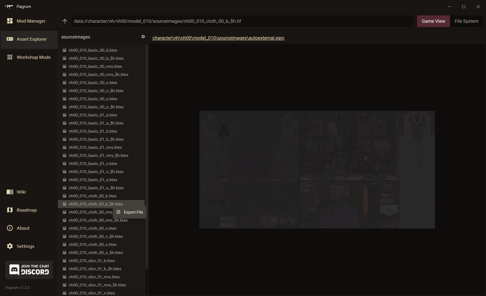
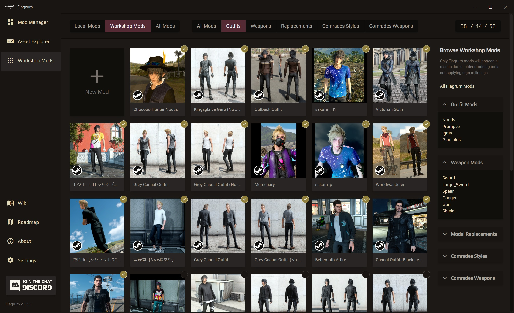

     
    &nbsp;

---
<h3 align="center">An all-in-one solution for modders, artists, and players of Final Fantasy XV</h3>

Join us over at the <a href="https://discord.gg/7cNNwwJKsJ">EXINERIS Discord</a> for discussion and collaboration!

---

 
 
&nbsp;

<h1 align="center">Asset Management</h1>

<pre align="center">
<h3>    ● Browse and preview game files without extracting anything 
    ● The largest range of asset conversions available of any FFXV tools 
    ● Export environments and terrain effortlessly</h3>
</pre>
&nbsp;

 

<h1 align="center">Gameplay Mods</h1>

<pre align="center">
<h3>    ● Install, manage, create, edit, and toggle mods at will 
    ● Built-in tooling to make gameplay modding more manageable 
    ● Easily export your mods for distribution</h3>
</pre>
&nbsp;

 

<h1 align="center">Steam Workshop Mods</h1>

<pre align="center">
<h3>    ● View and manage your Steam Workshop mods and limits 
    ● Alter stats of any outfits you have downloaded from Steam Workshop 
    ● Fast and easy creation of your own Steam Workshop mods</h3>
</pre>
&nbsp;

 

<h1 align="center">Getting Started</h1>
 
<h3 align="center">Installation</h3>

Download the latest version and follow the instructions on the <a href="https://github.com/Kizari/Flagrum/releases/latest">Releases Page</a>.

 
<h3 align="center">Tutorials and Documentation</h3>

All of Flagrum's incredible documentation can be found on the <a href="https://github.com/Kizari/Flagrum/wiki">EXINERIS Wiki</a>.  

 

&nbsp;

 

<h1 align="center">Support the Continued Development of FFXV Tools</h1>
 

These tools take a monumental amount of time and effort to develop. 
If you want to support the ongoing development of Flagrum and my other XV projects, please consider donating.   
&nbsp;&nbsp;
&nbsp;&nbsp;

 

&nbsp;

 

<h1 align="center">Credits</h1>
 
<h3 align="center">Core Development</h3>

Kizari

 
<h3 align="center">Contributors</h3>

Rinual 
AsteriskAmpersand 
ImpatientTraveler 
Katelynn Kittaly 
Chisa 
Sai 

 
<h3 align="center">Special Thanks</h3>

Elisa 
Saturn 
Castagnaccio

## License
